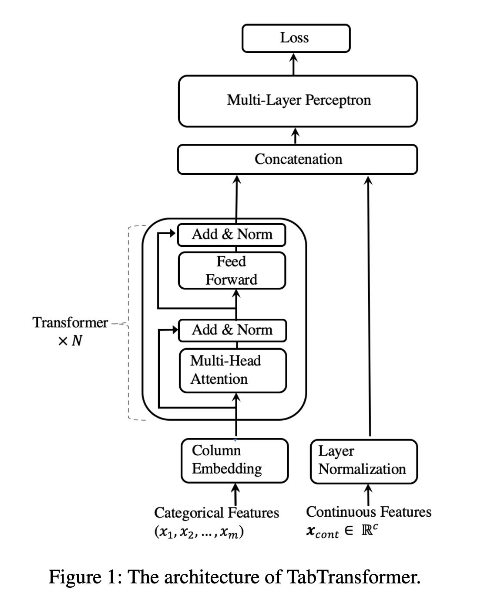

<p align="center">
  
</p>

Source: [TabTransformer: Tabular Data Modeling Using Contextual Embeddings](https://arxiv.org/pdf/2012.06678v1.pdf)

# tabtransformers
Table of content
- [Latest Upgrade](#latest-upgrade)
- [Motivation](#motivation)
- [Modules](#modules)
  - [Models](#models)
  - [Dataset](#dataset)
  - [Tools](#tools)
  - [Others](#others)
- [Usage](#usage)
- [Conclusion](#conclusion)
- [License](#license)
- [Contribution](#contribution)
- [Reference](#reference)

## Latest Upgrade
In our latest update, we've implemented a unified training process that supports both regression and classification tasks within the same Python script. 

For any specific dataset, **all you need** to do is adjust the configuration file, and you can effortlessly apply the models in this repository to your own task.

## Motivation
Tabular data plays a pivotal role in many Kaggle competitions, highlighting the need for a versatile framework that integrates various architectures tailored for such datasets. 

Since the revolutionary "[Attention Is All You Need](https://proceedings.neurips.cc/paper/2017/file/3f5ee243547dee91fbd053c1c4a845aa-Paper.pdf)" paper, Transformer-based models have demonstrated exceptional generalization capabilities across numerous domains, including computer vision (CV) and natural language processing (NLP). Our goal is to harness these capabilities for tabular data. 

Despite the existence of Transformer-based frameworks for tabular data, we observe a scarcity in PyTorch-based implementations. Furthermore, many existing APIs fall short in providing satisfactory coding practices, and end-to-end frameworks remain nearly nonexistent. Although challenging, we believe it's a worthwhile endeavor to explore.

## Modules
### Models
- TabularTransformer
Source: [TabTransformer: Tabular Data Modeling Using Contextual Embeddings](https://arxiv.org/pdf/2012.06678v1.pdf)

- FeatureTokenizerTransformer
Source: [Revisiting Deep Learning Models for Tabular Data](https://arxiv.org/pdf/2106.11959v2.pdf)

### Dataset
Provides a PyTorch-compatible dataset implementation for streamlined data handling.

### Tools
- `train`, `inference`      
  Essential functions for training models and making predictions.

- `seed_everything`     
  Ensures reproducibility by setting a global random seed.

- `get_data`, `get_dataset`, `get_data_loader`      
  Includes functions for efficient data manipulation.

- `plot_learning_curve`     
  Visualizes the training and validation loss over epochs.

- `to_submission_csv`     
  Facilitates the creation of submission files for Kaggle competitions.

## Others
Introduces custom metrics specifically designed for Kaggle competitions.

## Usage
Detailed examples demonstrating the usage of our models can be found in the [template](templates/) directory. Please ensure that the `.csv` files are placed in the `data` directory by default.

### Regression Task
For the regression task, we use the [Regression with an Abalone Dataset](https://www.kaggle.com/competitions/playground-series-s4e4) as an example.

We provide a feasible solution outlined in the configuration file [templates/config_regression.yaml](templates/config_regression.yaml).  Achieving SOTA performance requires significant effort, tricks, and time.

To train a TabTransformer model, use the following command:

```bash
python3 train.py --config templates/config_regression.yaml
```

### Classification Task
Similarly, we use the [ML Olympiad - Predicting Earthquake Damage](https://www.kaggle.com/competitions/ml-olympiad-predicting-earthquake-damage) dataset to illustrate the classification task.

Rather than fully tackling this complex problem, our goal is to demonstrate how to use the training process. Thus, we only use a subset of the features as inputs.

You can train the model in the same way:

```bash
python3 train.py --config templates/config_regression.yaml
```

## Conclusion
We present an end-to-end, PyTorch-based Transformer framework specifically designed for tabular data. Accompanied by pre-integrated templates and functions, our framework aims to streamline your workflows without sacrificing flexibility. We believe it will prove to be a valuable asset for your data modeling tasks.

## License
This project is licensed under the [MIT License](LICENSE).

## Contribution
- Contributions are welcome! For guidelines, please refer to our [contribution guide](https://github.com/RichardLitt/knowledge/blob/master/github/amending-a-commit-guide.md).

## Reference
- Vaswani, A., Shazeer, N., Parmar, N., Uszkoreit, J., Jones, L., Gomez, A. N., Kaiser, Ł., & Polosukhin, I. (2017). Attention is all you need. In Advances in neural information processing systems (Vol. 30).
- Gorishniy, Y., Rubachev, I., Khrulkov, V., & Babenko, A. (2021). Revisiting deep learning models for tabular data. In Advances in Neural Information Processing Systems (Vol. 34, pp. 18932–18943).
- Huang, X., Khetan, A., Cvitkovic, M., & Karnin, Z. (2020). Tabtransformer: Tabular data modeling using contextual embeddings. arXiv preprint arXiv:2012.06678.
